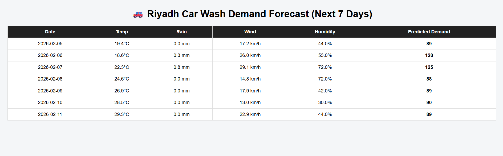

# 🚗 Weather-Based Car Wash Demand Forecasting

This project predicts car wash demand in Riyadh for the next 7 days using weather forecasts and machine learning.

## 🔍 Problem
Car wash demand fluctuates based on weather conditions, weekends, and seasonal patterns. This system helps forecast demand to support operational planning.

## ⚙️ Solution Overview
The system includes:

- Historical weather data processing
- Synthetic demand simulation (for prototype stage)
- Feature engineering with lag variables
- Random Forest regression model
- Multi-step recursive forecasting (7 days ahead)
- Live weather integration using Open-Meteo API
- FastAPI service for predictions
- Simple dashboard to display forecast and weather

## 📊 Model Performance
Baseline (lag-7 MAE): ~9.6  
Model MAE: ~4.0

## 🌦 Data Sources
- Historical weather: Open-Meteo archive
- Future weather: Open-Meteo forecast API

## 🚀 API Endpoint
POST /forecast  
Returns 7-day demand forecast with weather info.

## 📘 API Documentation (Swagger UI)

Below is the interactive API documentation generated by FastAPI:

## 🖥 Dashboard
Access via:  
`http://127.0.0.1:8000/`

## 🧠 Future Improvements
- Integrate real booking data from Firestore
- Track prediction vs actual demand
- Model retraining pipeline
